# Capability Lab

**Evidence-grounded capability modeling under explicit governance boundaries.**

[](https://github.com/kymuco/capability_lab/actions/workflows/ci.yml)
[](https://github.com/kymuco/capability_lab/actions/workflows/docs.yml)
[](pyproject.toml)
[](LICENSE)

> **Observation is not evidence. Evidence is not a claim. Supported is not mastery. Current is not permission.**

[Documentation](https://kymuco.github.io/capability_lab/) ·
[Architecture](docs/architecture.md) ·
[Constitution](docs/constitution.md) ·
[Consumer boundary](docs/consumer-boundary.md) ·
[Reference map](docs/reference/archive.md)

**Status:** stable research subsystem · public source-available checkpoint · development is demand-driven.

Capability Lab is an experimental Python framework for representing what has been observed, what the
evidence can support, what remains uncertain, and what development paths may be worth considering —
without turning a model, score, recommendation, or product view into authority over the person.

The current public distribution uses the
[PolyForm Noncommercial License 1.0.0](LICENSE); commercial use that requires rights beyond that grant
requires [separate commercial licensing](COMMERCIAL-LICENSING.md).

## Why Capability Lab

Most learning and professional systems lean on proxies: courses, titles, credentials, tests, or self-reported
skills. Capability Lab explores a different architecture built around provenance, explicit uncertainty,
append-only evaluation history, human review, and governed state transitions.

The system deliberately preserves distinctions that are easy to collapse:

```text
observation
!= evidence
!= interpretation
!= claim
!= evaluation
!= derived state
!= persisted state
!= accepted state
!= current state
!= progression advice
!= product/read projection
!= permission or authority
```

It does **not** attempt to compute a person's value, intelligence, destiny, professional license, or right to act.

## Current architecture

The generic public path composes end to end:

```mermaid
flowchart LR
    O["External observation"] --> H["Human review"]
    H --> E["Neutral evidence"]
    E --> I["Governed interpretation"]
    I --> C["Claim"]
    C --> V["Conservative + domain-sufficient evaluation"]
    V --> D["Complete-history capability state"]
    D --> P["Persistence"]
    P --> A["Explicit acceptance"]
    A --> S["Current-state selection"]
    S --> G["Advisory progression + current profile"]
    G --> R["Governed product/read snapshot"]
```



The architecture treats the read surface as a projection, not as authority:

```text
PRODUCT / READ SNAPSHOT
!= CURRENT-STATE SELECTION AUTHORITY
!= PROGRESSION AUTHORITY
!= CAPABILITY UPDATE AUTHORITY
!= PERMISSION OR PROFESSIONAL AUTHORITY
```

Executable contracts cover the generic observation path through governed current state and the product/read
boundary. The product surface has no capability write-back authority, and automatic closed-loop capability
updates remain **not authorized**.

## Stable consumer boundary

The current consumer contract is `CurrentStateGovernedPlayerWindow`.

A consumer may present governed current state and advisory progression. It does not choose the current state,
grant readiness or mastery, or turn a serialized snapshot into live authority.

Start with [Consume the governed read boundary](docs/consumer-boundary.md).

## Research lineage

Capability Lab began with Civilization Bootstrap Engineering as a demanding domain stress test. The repository
retains that research and Pilot history, while the generic path is deliberately independent of the
Pilot-specific production path.

The current public Git history intentionally begins from a clean source-available snapshot. Technical
PR/milestone references retained in research documents are documentation provenance, not published Git ancestry.

See [Publication lineage](PUBLICATION.md) and the [reference/archive map](docs/reference/archive.md).

## Development

Requires Python 3.11+.

```bash
python -m pip install -e ".[dev]"
python -m pytest -q
```

Documentation development:

```bash
python -m pip install -e ".[docs]"
zensical build --clean --strict
```

## Reporting and discussion

Use the repository Issue Forms for reproducible non-sensitive bugs, documentation problems, and
research/architecture discussion.

Security- or privacy-sensitive reports must follow [SECURITY.md](SECURITY.md). Do not put credentials,
person-scoped records, private captures, private workspaces, or exploit details into a public issue.

Research discussion and conceptual proposals are welcome. Until a dedicated contributor-rights process exists,
substantive third-party authored material is not accepted for inclusion and cannot be merged; see
[CONTRIBUTING.md](CONTRIBUTING.md).

## License

Capability Lab is **source-available**, not OSI open source, under the
[PolyForm Noncommercial License 1.0.0](LICENSE) (`PolyForm-Noncommercial-1.0.0`).

Commercial rights are available separately where a license from the project is required; see
[Commercial licensing](COMMERCIAL-LICENSING.md).

Earlier versions were previously distributed under Apache-2.0. Rights already granted for those earlier copies
remain in force for those copies; see [License history](LICENSE-HISTORY.md).
