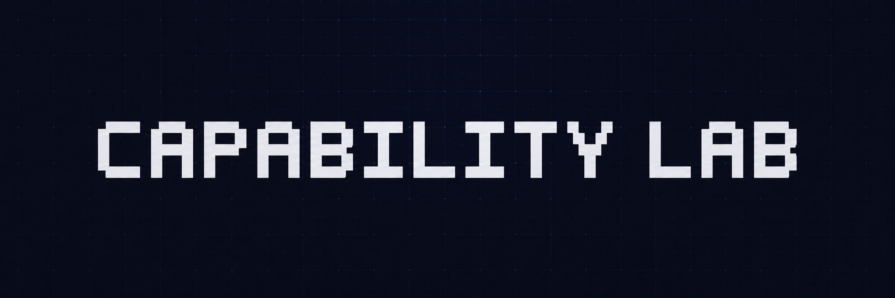
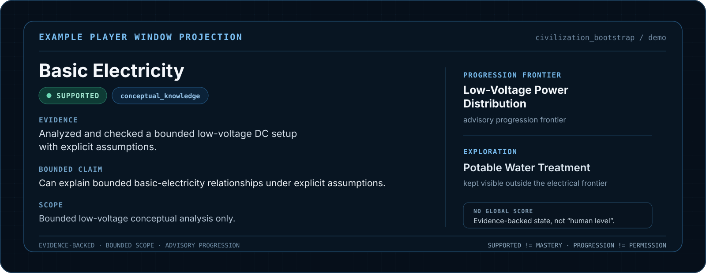
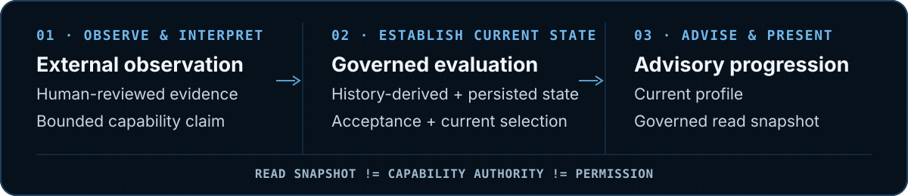

<p align="center">
  
</p>

<p align="center">
  <strong>A real-world capability profile built from evidence, not arbitrary scores.</strong>
</p>

<p align="center">
  What was observed? · What does the evidence support? · What remains uncertain? · What may be worth exploring next?
</p>

<p align="center">
  <a href="docs/getting-started.md">Start in 5 minutes</a> ·
  <a href="https://kymuco.github.io/capability_lab/">Documentation</a> ·
  <a href="docs/governed-pipeline.md">How it works</a> ·
  <a href="docs/architecture.md">Architecture</a>
</p>

<p align="center">
  
</p>

The snapshot above is grounded in the included dependency-free
[`Civilization Bootstrap Player Window` demo](src/capability_lab/player_window/demo.py). It uses synthetic
`Basic Electricity` evidence, a bounded claim evaluated as `SUPPORTED`, a derived `conceptual_knowledge` state, a progression
frontier toward `Low-Voltage Power Distribution`, and an explicit exploration opportunity for
`Potable Water Treatment`.

The demo is a presentation fixture. The separate generic integration path proves the governed chain from
external observation through reviewed evidence, bounded claim interpretation, domain evaluation, persisted /
accepted / current state, progression, and the governed product/read snapshot.

[](https://github.com/kymuco/capability_lab/actions/workflows/ci.yml)
[](https://github.com/kymuco/capability_lab/actions/workflows/docs.yml)
[](pyproject.toml)
[](LICENSE)

## Why Capability Lab

Many systems compress capability into a score, credential, title, or self-reported skill. Capability Lab keeps
the evidence and the limits of the evidence visible.

- **Evidence keeps provenance and context.** An observation does not become evidence merely because a model saw it.
- **Unknown and conflict stay representable.** Missing evidence is not silently converted into zero, and disagreement does not have to be averaged away.
- **History is part of the basis.** Complete governed evaluation history is retained instead of using a hidden latest-wins shortcut.
- **Advice stays advisory.** Progression and presentation do not grant mastery, readiness, licensing, or permission.

> **Observation is not evidence. Evidence is not a claim. Supported is not mastery. Current is not permission.**

In technical terms: **Evidence-grounded capability modeling under explicit governance boundaries.**

## What exists today

The public Python package contains executable contracts for:

- shared capability concepts, relations, competence frames, and a Civilization Bootstrap seed catalog;
- person-scoped evidence, bounded claims, evaluations, provenance, serialization, and append-only epistemic succession;
- generic external observations with reviewed neutral-evidence materialization;
- reviewed evidence-to-claim interpretation and governed domain-policy evaluation;
- complete-history capability-state derivation, persistence, explicit acceptance, and explicit current-state selection;
- advisory progression frontiers and complete current-state portfolios;
- `PlayerWindow` presentation plus `CurrentStateGovernedPlayerWindow`, which fresh-composes governed current state and progression for a read-only product boundary;
- achievements, milestones, personal-history records, legends, and proposal records as separate layers;
- executable generic end-to-end audits from external observation to governed current state and product/read composition.

Capability Lab is a **research framework and reference subsystem**, not a finished consumer application and not an
automatic closed-loop judge of a person.

## How it works

<p align="center">
  <picture>
    <source media="(max-width: 640px)" srcset="docs/assets/capability-lab-architecture-stack.svg">
    
  </picture>
</p>

This is the compact mental model. [Follow the full governed pipeline](docs/governed-pipeline.md) for the exact
stage-by-stage contracts.

The product/read boundary remains a projection, not authority:

```text
PRODUCT / READ SNAPSHOT
!= CURRENT-STATE SELECTION AUTHORITY
!= PROGRESSION AUTHORITY
!= CAPABILITY UPDATE AUTHORITY
!= PERMISSION OR PROFESSIONAL AUTHORITY
```

Automatic closed-loop capability updates remain **not authorized**.

## Start here

- **New to the project:** [Capability Lab in 5 minutes](docs/getting-started.md)
- **Want the mental model:** [Understand the model](docs/overview.md)
- **Want the full chain:** [Follow the governed pipeline](docs/governed-pipeline.md)
- **Integrating a product:** [Consume the governed read boundary](docs/consumer-boundary.md)
- **Reviewing the implementation:** [Architecture](docs/architecture.md)
- **Reviewing the normative rules:** [Constitution](docs/constitution.md)

## Project status

**Stable research subsystem · public source-available checkpoint · development is demand-driven.**

Requires Python 3.11+.

```bash
python -m pip install -e ".[dev]"
python -m pytest -q
```

Documentation:

```bash
python -m pip install -e ".[docs]"
zensical build --clean --strict
```

The current public Git history intentionally begins from a clean source-available snapshot; detailed historical
research references remain documentation provenance rather than published Git ancestry. See
[Publication lineage](PUBLICATION.md).

## Reporting and discussion

Use the repository Issue Forms for reproducible non-sensitive bugs, documentation problems, and
research/architecture discussion. Security- or privacy-sensitive reports must follow [SECURITY.md](SECURITY.md).

Until a dedicated contributor-rights process exists, substantive third-party authored material is not accepted
for inclusion; see [CONTRIBUTING.md](CONTRIBUTING.md).

## License

Capability Lab is **source-available**, not OSI open source, under the
[PolyForm Noncommercial License 1.0.0](LICENSE) (`PolyForm-Noncommercial-1.0.0`).

Commercial rights are available separately where a license from the project is required; see
[Commercial licensing](docs/project/commercial-licensing.md).

Earlier versions were previously distributed under Apache-2.0. Rights already granted for those earlier copies
remain in force for those copies; see [License history](docs/project/license-history.md).
