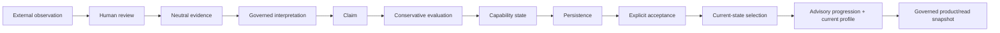

<p align="center">
  
</p>

# Capability Lab

**A real-world capability profile built from evidence, not arbitrary scores.**

Capability Lab is an experimental Python framework for building a careful picture of what the current evidence
supports about a person's capabilities, what is still unknown or conflicting, and what may be worth exploring
next.

Think of a **skill tree or player profile that has to show its work**: a capability does not appear because a
number went up. It must remain connected to the evidence, context, uncertainty, and history behind it.

[Start in 5 minutes](docs/getting-started.md) ·
[Documentation](https://kymuco.github.io/capability_lab/) ·
[How it works](docs/governed-pipeline.md) ·
[Architecture](docs/architecture.md)

[](https://github.com/kymuco/capability_lab/actions/workflows/ci.yml)
[](https://github.com/kymuco/capability_lab/actions/workflows/docs.yml)
[](pyproject.toml)
[](LICENSE)

**Status:** stable research subsystem · public source-available checkpoint · development is demand-driven.

## A simple example

Imagine someone builds and explains a working low-voltage motor circuit.

Capability Lab can keep the different meanings separate:

| Question | Example |
| --- | --- |
| What happened? | A motor circuit was built, tested, and explained. |
| What became reviewed evidence? | The project artifact, explanation, and test results accepted by the governing workflow. |
| What might that evidence support? | A bounded claim about basic low-voltage circuit construction. |
| What is still unknown? | RF design, high-voltage work, long-term retention, and anything else not actually evidenced. |
| What might be useful next? | An advisory challenge such as diagnosing an unfamiliar circuit fault. |

One successful project does **not** silently become:

```text
Electrical engineering: 87%
```

That is the point of Capability Lab.

> **Observation is not evidence. Evidence is not a claim. Supported is not mastery. Current is not permission.**

## Why Capability Lab

Many systems describe people using proxies: course completion, credentials, self-reported skills, rankings, or
single scores. Those can be useful, but they often hide how a conclusion was reached and what remains unknown.

Capability Lab explores a different model:

- evidence keeps its provenance and context;
- missing evidence stays unknown instead of becoming zero;
- conflicting evidence can remain unresolved;
- history is retained instead of silently replacing an older result with the newest one;
- progression can suggest a next step without becoming a prescription;
- a product view does not become permission, licensing, or authority over the person.

In technical terms: **Evidence-grounded capability modeling under explicit governance boundaries.**

## When would I use it?

Capability Lab is relevant when a system needs to reason about human capability **without pretending it knows
more than the evidence supports**.

Examples include:

- personal learning and development systems;
- AI assistants that need a careful model of a user's demonstrated capabilities;
- evidence-backed skill or progression interfaces;
- research into capability representation, uncertainty, provenance, and human agency;
- products that need an advisory capability view without turning that view into ranking or permission.

Capability Lab is currently a **research framework and reference subsystem**, not a finished consumer app.

## What it is not

Capability Lab is not:

- an intelligence test;
- a personality score;
- an HR ranking system;
- a universal human level;
- a professional licensing system;
- an automatic judge of what a person should do;
- a source of permission or authority merely because a capability is supported.

It does **not** attempt to compute a person's value, intelligence, destiny, professional license, or right to act.

## How it works

The generic public path keeps interpretation and authority as explicit steps:


```mermaid
flowchart LR
    O["External observation"] --> H["Human review"]
    H --> E["Neutral evidence"]
    E --> I["Governed interpretation"]
    I --> C["Claim"]
    C --> V["Conservative evaluation"]
    V --> D["Capability state"]
    D --> P["Persistence"]
    P --> A["Explicit acceptance"]
    A --> S["Current-state selection"]
    S --> G["Advisory progression + current profile"]
    G --> R["Governed product/read snapshot"]
```

The product/read surface remains a projection, not authority:

```text
PRODUCT / READ SNAPSHOT
!= CURRENT-STATE SELECTION AUTHORITY
!= PROGRESSION AUTHORITY
!= CAPABILITY UPDATE AUTHORITY
!= PERMISSION OR PROFESSIONAL AUTHORITY
```

The system deliberately preserves distinctions that are easy to collapse:

```text
observation
!= evidence
!= interpretation
!= claim
!= evaluation
!= derived state
!= persisted state
!= accepted state
!= current state
!= progression advice
!= product/read projection
!= permission or authority
```

Executable contracts cover the generic observation path through governed current state and the product/read
boundary. Automatic closed-loop capability updates remain **not authorized**.

## Stable consumer boundary

The current consumer contract is `CurrentStateGovernedPlayerWindow`.

A consumer may present governed current state and advisory progression. It does not choose the current state,
grant readiness or mastery, or turn a serialized snapshot into live authority.

Start with [Consume the governed read boundary](docs/consumer-boundary.md).

## Research lineage

Capability Lab began with a simple question: could a person have something like a real-world skill tree where
each capability had to earn its place through evidence rather than XP?

Civilization Bootstrap Engineering became the first demanding domain stress test. As the idea became more
serious, the project had to answer harder questions about uncertainty, conflicting evidence, history, privacy,
human agency, and authority. The current framework grew out of those questions.

The current public Git history intentionally begins from a clean source-available snapshot. Technical
PR/milestone references retained in research documents are documentation provenance, not published Git ancestry.

See [Publication lineage](PUBLICATION.md) and the [reference/archive map](docs/reference/archive.md).

## Development

Requires Python 3.11+.

```bash
python -m pip install -e ".[dev]"
python -m pytest -q
```

Documentation development:

```bash
python -m pip install -e ".[docs]"
zensical build --clean --strict
```

## Reporting and discussion

Use the repository Issue Forms for reproducible non-sensitive bugs, documentation problems, and
research/architecture discussion.

Security- or privacy-sensitive reports must follow [SECURITY.md](SECURITY.md). Do not put credentials,
person-scoped records, private captures, private workspaces, or exploit details into a public issue.

Research discussion and conceptual proposals are welcome. Until a dedicated contributor-rights process exists,
substantive third-party authored material is not accepted for inclusion and cannot be merged; see
[CONTRIBUTING.md](CONTRIBUTING.md).

## License

Capability Lab is **source-available**, not OSI open source, under the
[PolyForm Noncommercial License 1.0.0](LICENSE) (`PolyForm-Noncommercial-1.0.0`).

Commercial rights are available separately where a license from the project is required; see
[Commercial licensing](COMMERCIAL-LICENSING.md).

Earlier versions were previously distributed under Apache-2.0. Rights already granted for those earlier copies
remain in force for those copies; see [License history](LICENSE-HISTORY.md).
