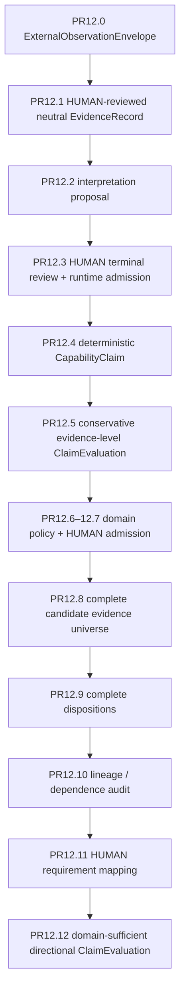
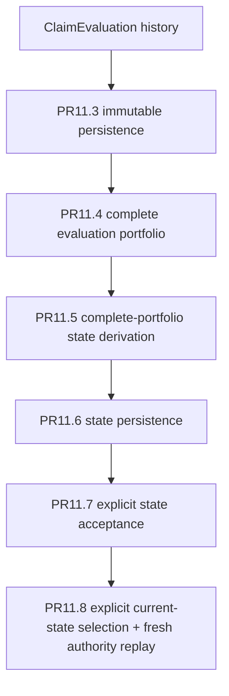
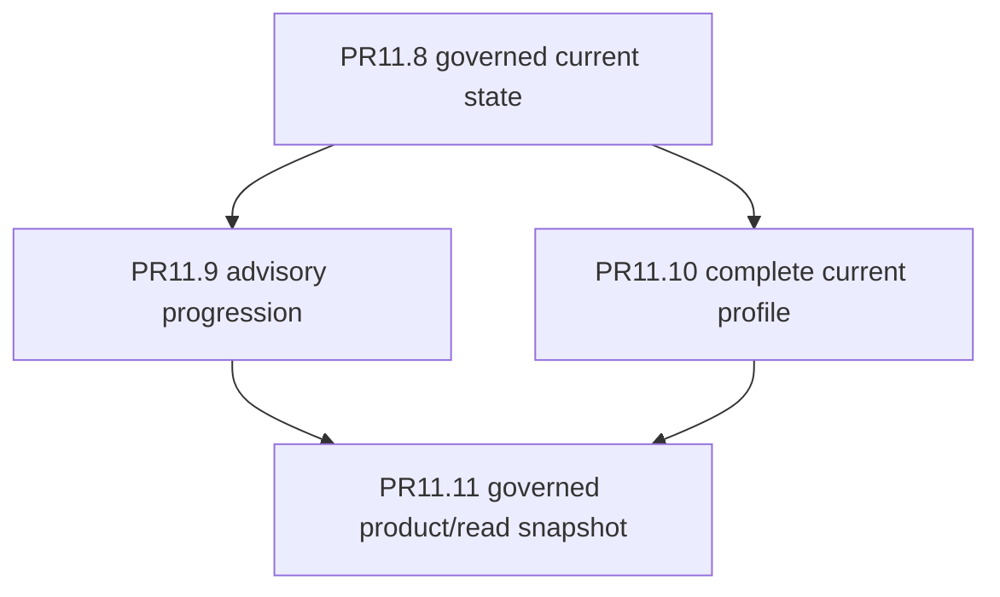

# Follow the governed pipeline

Capability Lab's public checkpoint is best understood as two governed chains that meet at current state.

The first chain turns an external observation into evidence and capability evaluation.
The second turns governed evaluation history into current state, advisory progression, and a safe read projection.

## External observation → governed evaluation



Several non-inference rules are deliberate:

- requirement mapping is not directional evidence selection;
- reliability is not a hidden threshold;
- shared lineage does not become positive independence;
- evidence count is not majority vote;
- a real support/contradiction conflict remains `MIXED / UNRESOLVED`.

The exact contracts live in the [reference map](reference/archive.md).

## Governed evaluation → current state



There is no latest-wins rule. Structural history is not sufficient authority by itself; current selection
must survive fresh replay against the exact persisted state and acceptance basis.

## Current state → advisory/read surface



PR11.11 does not accept a prebuilt frontier, prebuilt current portfolio, or caller-selected state IDs.
It freshly composes the governed inputs from the same live source history.

`CLEAR` remains different from `ABSENT`, and an old serialized snapshot becomes stale when its governed
source history changes.

## The executable proof

PR12.13 proves the generic observation path can reach a governed current state through the real public APIs.
PR12.14 proves the same trace reaches PR11.11 without giving the product surface state-selection or write-back authority.

- [PR12.13 — observation to governed current state](generic_capability_inference_e2e_audit_v1.md)
- [PR12.14 — observation to governed product/read snapshot](generic_governed_product_read_e2e_audit_v1.md)

These audits are integration proofs, not new inference layers.

## What is intentionally still absent

```text
automatic activity -> capability update
automatic product write-back
readiness / mastery authority
professional permission
human-worth scoring
```

Those are not implied by the existence of the governed pipeline.
