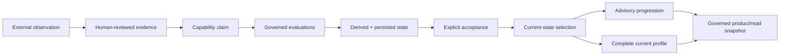

---
hide:
  - toc
---

<div class="cl-hero">
  <div class="cl-eyebrow">Evidence-grounded capability modeling</div>
  <h1>Capability claims you can inspect.</h1>
  <p class="cl-lede">
    Capability Lab is a governed research framework for representing what was observed,
    what the evidence can support, what remains uncertain, and what may be worth exploring next —
    without turning the model into authority over the person.
  </p>
  <div class="cl-actions">
    <a class="md-button md-button--primary" href="overview/">Understand the model</a>
    <a class="md-button" href="governed-pipeline/">Follow the governed pipeline</a>
  </div>
</div>

<div class="cl-proof" markdown>
  <div><strong>Append-only</strong><span>evidence and evaluation history</span></div>
  <div><strong>Explicit gates</strong><span>human review and runtime admission</span></div>
  <div><strong>Complete history</strong><span>no hidden latest-wins shortcut</span></div>
  <div><strong>Read ≠ authority</strong><span>projection never grants permission</span></div>
</div>

## A model that preserves the difference between knowing and deciding

Most capability systems collapse several questions into one score: what happened, what it means,
how confident the system is, what the person should do next, and whether they are allowed to act.

Capability Lab keeps those questions separate.

<div class="cl-equation" markdown>
```text
observation
!= evidence
!= interpretation
!= claim
!= evaluation
!= capability state
!= accepted state
!= current state
!= progression advice
!= product/read projection
!= permission or authority
```
</div>

<div class="cl-path-grid">
  <a class="cl-path-card" href="overview/">
    <span class="cl-kicker">01 · Mental model</span>
    <strong>Understand the layers</strong>
    <p>See why evidence, uncertainty, conflict, state, and authority are deliberately different objects.</p>
  </a>
  <a class="cl-path-card" href="governed-pipeline/">
    <span class="cl-kicker">02 · Provenance</span>
    <strong>Follow the governed pipeline</strong>
    <p>Trace a reviewed external observation through evaluation, state, progression, and the product/read boundary.</p>
  </a>
  <a class="cl-path-card" href="consumer-boundary/">
    <span class="cl-kicker">03 · Integration</span>
    <strong>Consume without taking authority</strong>
    <p>Use the stable PR11.11 read boundary while preserving fresh validation and governance semantics.</p>
  </a>
</div>

## The complete public path



PR12.13 proves the generic path reaches governed current state without bypassing the existing gates.
PR12.14 extends that proof through advisory progression, complete current profile, and the PR11.11
product/read snapshot.

[Read the end-to-end current-state audit](generic_capability_inference_e2e_audit_v1.md){ .cl-inline-link }
·
[Read the product/read audit](generic_governed_product_read_e2e_audit_v1.md){ .cl-inline-link }

<div class="cl-boundary" markdown>
### The boundary is part of the product

Capability Lab does **not** compute a person's value, destiny, professional license, permission,
or human worth. `SUPPORTED` is not mastery. `CURRENT` is not readiness. Progression is advisory.
A rendered product view does not become capability write-back authority.

[Read the constitution](constitution.md)
</div>

## Built as a reference system, not a ranking product

The current checkpoint is intentionally conservative. It preserves unknowns, permits unresolved
conflict, retains historical evaluations, requires explicit state acceptance and current selection,
and treats serialized artifacts as audit data that must revalidate against live governed sources.

For the underlying contracts, start with the [architecture](architecture.md), then use the
[reference map](reference/archive.md) to reach the detailed PR-specific documents and historical Pilot material.
