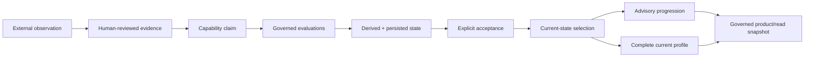

---
hide:
  - toc
---

<div class="cl-hero">
  <div class="cl-eyebrow">Evidence-backed human capability modeling</div>
  <h1>Know what the evidence actually supports.</h1>
  <p class="cl-lede">
    Capability Lab is an experimental framework for building a careful capability profile:
    what the evidence supports now, what remains unknown or conflicting, and what may be worth
    exploring next — without turning the model into authority over the person.
  </p>
  <div class="cl-actions">
    <a class="md-button md-button--primary" href="getting-started/">Capability Lab in 5 minutes</a>
    <a class="md-button" href="governed-pipeline/">See how it works</a>
  </div>
</div>

<div class="cl-proof" markdown>
  <div><strong>Evidence-backed</strong><span>claims stay connected to what supports them</span></div>
  <div><strong>Unknown stays unknown</strong><span>missing evidence does not become zero</span></div>
  <div><strong>History preserved</strong><span>new results do not silently erase old ones</span></div>
  <div><strong>Advice ≠ authority</strong><span>progression never becomes permission</span></div>
</div>

## A real-world skill tree that has to show its work

The easiest intuition is a skill tree or player profile — except a capability does not appear because an XP bar
filled up. It has to remain grounded in real evidence, context, uncertainty, and history.

Capability Lab is interested in questions such as:

- What does the current evidence actually support?
- What do we still not know?
- Where does the evidence disagree?
- What development path might be useful to explore next?
- How can a product show that state without turning it into a ranking or permission system?

## One executable presentation example

The repository includes a dependency-free Civilization Bootstrap Player Window demo. Its synthetic example
constructs:

| Layer | Included demo |
| --- | --- |
| Capability | `Basic Electricity` |
| Evidence | A bounded low-voltage DC setup analyzed and checked with explicit assumptions |
| Supported dimension | `conceptual_knowledge` |
| Claim scope | Bounded low-voltage conceptual analysis only |
| Progression frontier | `Low-Voltage Power Distribution` |
| Exploration opportunity | `Potable Water Treatment` |

The presentation demo is intentionally separate from the generic governed write-path proof. The generic
integration suites independently verify external observation → reviewed evidence → bounded claim →
domain evaluation → governed current state → progression/product-read composition.

## The core idea

Most capability systems collapse several different questions into one score: what happened, what it means,
how certain the result is, what the person should do next, and whether they are allowed to act.

Capability Lab keeps those questions separate.

<div class="cl-equation" markdown>
```text
observation
!= evidence
!= interpretation
!= claim
!= evaluation
!= capability state
!= accepted state
!= current state
!= progression advice
!= product/read projection
!= permission or authority
```
</div>

<div class="cl-path-grid">
  <a class="cl-path-card" href="getting-started/">
    <span class="cl-kicker">01 · Start here</span>
    <strong>Understand Capability Lab in 5 minutes</strong>
    <p>Walk through the conceptual model from activity to evidence, capability state, and advisory progression.</p>
  </a>
  <a class="cl-path-card" href="overview/">
    <span class="cl-kicker">02 · Mental model</span>
    <strong>Understand the layers</strong>
    <p>See why evidence, uncertainty, conflict, state, and authority are deliberately different objects.</p>
  </a>
  <a class="cl-path-card" href="consumer-boundary/">
    <span class="cl-kicker">03 · Integration</span>
    <strong>Consume without taking authority</strong>
    <p>Use the stable governed read boundary without turning a product view into capability write-back or permission.</p>
  </a>
</div>

## The complete public path


```mermaid
flowchart LR
    O[External observation] --> R[Human-reviewed evidence]
    R --> C[Capability claim]
    C --> E[Governed evaluations]
    E --> S[Derived + persisted state]
    S --> A[Explicit acceptance]
    A --> X[Current-state selection]
    X --> P[Advisory progression]
    X --> V[Complete current profile]
    P --> W[Governed product/read snapshot]
    V --> W
```

Executable end-to-end audits cover the path from reviewed external observation through governed current state
and through the product/read boundary without adding a shortcut around the existing gates.

[Read the end-to-end current-state audit](generic_capability_inference_e2e_audit_v1.md){ .cl-inline-link }
·
[Read the product/read audit](generic_governed_product_read_e2e_audit_v1.md){ .cl-inline-link }

<div class="cl-boundary" markdown>
### The boundary is part of the product

Capability Lab does **not** compute a person's value, destiny, professional license, permission,
or human worth. `SUPPORTED` is not mastery. `CURRENT` is not readiness. Progression is advisory.
A rendered product view does not become capability write-back authority.

[Read the constitution](constitution.md)
</div>

## Built as a reference system, not a ranking product

The current checkpoint is intentionally conservative. It preserves unknowns, permits unresolved
conflict, retains historical evaluations, requires explicit state acceptance and current selection,
and treats serialized artifacts as audit data that must revalidate against live governed sources.

For the underlying contracts, start with the [architecture](architecture.md), then use the
[reference map](reference/archive.md) to reach the detailed implementation-specific documents and historical
Pilot material.
